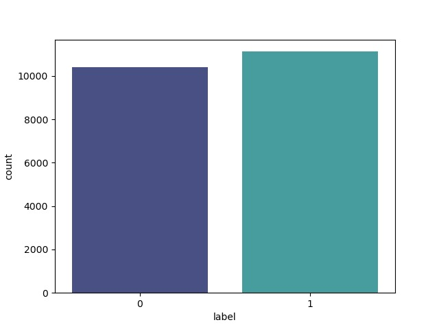
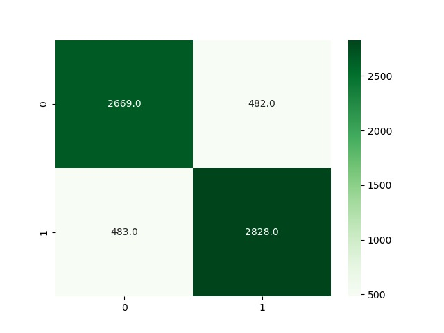

# Fake News Classification using NLP practises
***
The objective of this project is the classification of fake news.\
This project uses the following kaggle dataset: [here](https://www.kaggle.com/datasets/saurabhshahane/fake-news-classification) (92MB) \
Using _main.py_ the dataset auto-downloads using the library kagglehub and extracts the zip file using ZipFile.
Extracted dataset is 239MB and has 72,134 unique rows.
As default the program only uses about the first 20000 rows to ensure faster processing.\
The dataset has 4 columns:\
1. _title_: The title of the news article
2. _text_: The text of the news article
3. _Untitled: 0_: Unnecessary column that is removed upon loading the dataset
4. _label_: The label of the news article (0: Fake, 1: Real)\

The dataset is then cleaned by removing any rows with missing values.\
The dataset is then randomly split into training and testing sets with a ratio of 80:20.\
The text data is then preprocessed using the following steps:
1. Removing special characters
2. Removing stopwords
3. Tokenization
4. Embedding using selected model

The program automatically downloads and extracts the dataset from kaggle.\
Make sure to have the required libraries, if not run:\
If you are running Anaconda:    `conda install --yes --file requirements.txt`,\
If you are running Python:  `pip install requirements.txt`.\
To run the program, simply run _main.py_.\
At some point the program will ask to select which column to remove: _texts_ or _titles_.\
The first will make sure that the program uses the titles of the articles to classify if the news is fake or real. **FASTER**\
The latter will make sure that the program uses the body of the articles to classify if the news is fake or real. **SLOWER**\
Here's an example of the output of the program using a subset of the dataset including twenty thousand rows of titles:
```
CUDA available
[nltk_data] Downloading package stopwords to
[nltk_data]     C:\Users\GIUSEPPE\AppData\Roaming\nltk_data...
Already exists preprocessed data. Loading titles...
[nltk_data]   Package stopwords is already up-to-date!
Generating embeddings...

              precision    recall  f1-score   support

           0       0.85      0.85      0.85      3151
           1       0.85      0.85      0.85      3311

    accuracy                           0.85      6462
   macro avg       0.85      0.85      0.85      6462
weighted avg       0.85      0.85      0.85      6462

New title test: The president of the United States just declared war to Italy for enslaving the population of Iran
[0] - False
Elapsed time 5617.195504665375
```
Having this class distribution in which 0 represents fake news and 1 real news:\
\
And this confusion matrix:\
